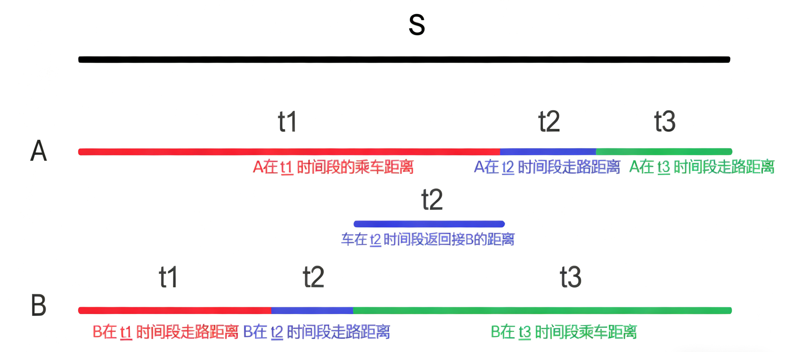

>干嘛说我的题解没营养？你题解里熬大骨头汤了？

# 每日两题
---


# 一、基础题
### 题目：[P1258 小车问题](https://www.luogu.com.cn/problem/P1258)

### 思路：
一道二分题，硬是弄成了数学题 🤣 (不过数学解起来确实更简单🤔)。以下提供数学的方法：
想要用最短的时间将两人同时送到终点，很显然是要用车将第一个人送到路程中的某一个点，然后放下这个人再回去接送另一个人，最后两人恰好同时到达终点。

如图所示，设人行走速度为 $v_1$, 车速度为 $v_2$。
我们可以列以下方程：

\[
\begin{cases}
&\text{对于A: }f_A = t_1 \cdot v_2 + t_2 \cdot v_1 + t_3 \cdot v_1 = s  \newline
&\text{对于B: }f_B = t_1 \cdot v_1 + t_2 \cdot v_1 + t_3 \cdot v_2 = s  \newline
&\text{小车放下A返回接B：}f_C = t_1 \cdot v_1 + t_2 \cdot v_1 = t_1 \cdot v_2 - t_2 \cdot v_2 \newline
&\text{结果：}f_{result} = t_1  + t_2 + t_3 \newline
\end{cases}
\]

联立 $f_A,f_B$，化简 $f_C$ 可得：

\[
\begin{cases}
&t_1 = t_3 \newline
&t_1 \cdot \frac{v_2-v_1}{v_2+v_1} = t_2 \newline
\end{cases}
\]

将结果重新带入 $f_A$ 可以算出 $t_1$ ，再通过结果的关系带入 $f_{result}$ 中可以得到最终结果。


可能涉及的知识：
- 二分
学习网站 [OI Wiki](https://oi-wiki.org/basic/binary/)，b站视频 [蛋从几层楼往下丢才会碎？一个视频讲明白【NotOnlySuccess】](https://www.bilibili.com/video/BV1DzXzYPEYT/?spm_id_from=333.337.search-card.all.click&vd_source=933c136d6897dbf20ff125fb1209208f) 

### 代码(c++)：
时间复杂度 **O(1)**，纯计算。

```cpp
#include <bits/stdc++.h>
using namespace std;
//偷懒宏定义
#define dd double

//s：路程
//v1：人速度
//v2：车速度
//v2>v1
void go() {
    dd s, v1, v2;
    cin >> s >> v1 >> v2;
    cout << fixed << setprecision(6);//确定输出精度
    dd k = (v2 - v1) / (v2 + v1);// 计算k -> t2 = t1*k
    dd t1 = s / (v1 + v2 + v1 * k);//计算t1
    dd tot = t1 * 2.0 + t1 * k;//计算总时间
    cout << tot;
    el;
}

signed main() {
    ios::sync_with_stdio(false);
    cin.tie(nullptr);
    cout.tie(nullptr);
    int _ = 1;
    // cin >> _;
    while (_--) {
        go();
    }
    return 0;
}
```


# 二、提高题
### 题目：[P10416 [蓝桥杯 2023 国 A] XYZ](https://www.luogu.com.cn/problem/P10416)

### 思路：
由题目可知，因为$L \leq X,Y,Z \leq R$，所以 $min_Z = 2 \cdot L$，因此当 $2 \cdot L > R$ 时，无法使 $X + Y = Z$ 在条件下成立，这时结果为 0。
在枚举时，
当 $X = L$时，$Y$ 范围为 $L \leq Y \leq R-L$，$Y$个数为 $R-2 \cdot L$；
当 $X = L+1$时，$Y$ 范围为 $L \leq Y \leq R-L-1$，$Y$个数为 $R-2 \cdot L-1$；
当 $X = L+2$时，$Y$ 范围为 $L \leq Y \leq R-L-2$，$Y$个数为 $R-2 \cdot L-2$；
······ 直到 $X = L+k$ 且 $R - 2 \cdot L - k =1$。
我们会发现，这是一个等差数列，所以总组数只需用等差数列求和即可。

### 代码(c++)：
时间复杂度 **O($t$)**，`t`为输入的组数

```cpp
#include <iostream>
#include <utility>
#include <vector>
#include <algorithm>

using namespace std;

void go() {
    long long l, r;
    cin >> l >> r;
    if (l * 2 > r) {
        cout << 0 << '\n';
        return;
    }
    long long ans = (1 + (r - 2 * l + 1)) * (r - 2 * l + 1) / 2;//(首项+末项)*项数/2
    cout << ans << '\n';
}

int main() {
    ios::sync_with_stdio(false);
    cin.tie(nullptr);
    cout.tie(nullptr);
    int t = 1;
    cin >> t;
    while (t--) {
        go();
    }
    return 0;
}

```

