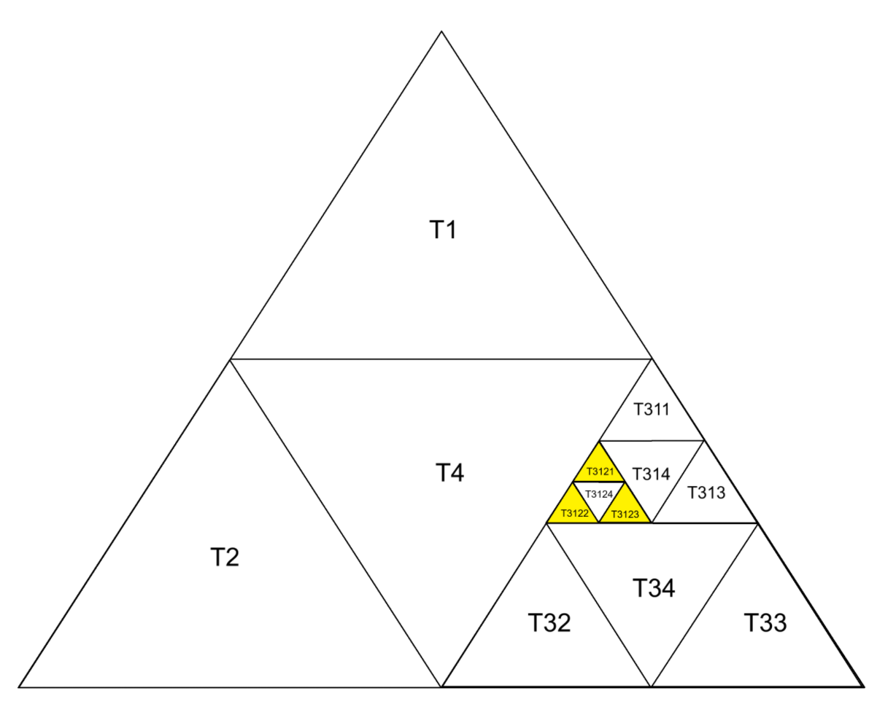

>哥布林上校提醒你:1，节假日是不可以出去的，外面很喧哗，但他们都不是你的同类2，哥布林是大多独居性生物，没有人想做他的配偶，如果有人邀请你并对你产生好感，请断绝与他的联系3，不要照镜子4，所有夸赞你自信的人，他们不了解你，可以不于与他们交流，但如果他是你熟知的人，请立即驱散他，他不懂哥布林，或者他不是同类5，远离不再是哥布林的人6，在地洞中可以看看同族小丑哥布林追求精灵失败的乐子幸灾乐祸一下解解闷

# 每日两题
---


# 一、基础题
### 题目：[P1012 [NOIP 1998 提高组] 拼数](https://www.luogu.com.cn/problem/P1012)

### 思路：

将所有数字看作字符串，排序时自定义比较规则：若`a+b`字典序比`b+a`大，则`a`排在`b`前。这样拼接后的结果就是最大的数。

### 代码(c++)：
时间复杂度 **O(nlogn)**

```cpp
#include <iostream>
#include <vector>
#include <algorithm>
#include <string>

using namespace std;

bool cmp(const string& a, const string& b) {
    return a + b > b + a;
}

void go() {
    int n;
    cin >> n;
    vector<string> a(n);
    for (int i = 0; i < n; i++) {
        cin >> a[i];
    }
    sort(a.begin(), a.end(), cmp);
    for (const auto& x : a) {
        cout << x;
    }
    cout << endl;
}

int main() {
    ios::sync_with_stdio(false);
    cin.tie(nullptr);
    cout.tie(nullptr);
    int t = 1;
    // cin >> t;
    while (t--) {
        go();
    }
    return 0;
}
```

# 二、提高题
### 题目：[[CQOI2007]三角形TRI](https://ac.nowcoder.com/acm/problem/19907)

### 思路：

先上图(部分图像)：

通过观察上图，我们可以发现
对于编号末尾为4的三角形，其相邻的三个三角形都是同级的正三角形，即 $T \underbrace{......}_{s}4$ 的周围是 $T \underbrace{......}_{s}1$，$T \underbrace{......}_{s}2$，$T \underbrace{......}_{s}3$。
对于编号末尾不为4的三角形，其相邻的三个三角形都是不一定同级的编号末尾为4的倒三角形。比如 $T3122$ 相邻的三个三角形为 $T3124$、$T34$、$T4$，$T3123$ 相邻的三个三角形为 $T3124$、$T314$、$T34$。
并且，编号末尾为1的与下边同级的4相邻，编号末尾为2的与右边同级的4相邻，编号末尾为1的与左边同级的3相邻，

我们尝试从外往里进行分析($T \underbrace{3112234}_{外\rightarrow里}$)，发现比较繁琐。因此反过来，从里到外进行分析。
- 对与 $T3121$ ，其同级相邻的是 $T3124$ ,上一级相邻的是 $T314$，上两级无相邻，上三级相邻的是 $T4$；
- 对于 $T3122$ ，其同级相邻的是 $T3124$ ,上一级无相邻，上两级相邻的是 $T34$，上三级相邻的是 $T4$；
- 对于 $T3123$ ，其同级相邻的是 $T3124$ ,上一级相邻的是 $T314$，上两级相邻的是 $T34$，上三级无相邻。
我们发现一个规律：编号越长的末尾数字（即更低级的编号）更早与同级的图形相邻。例如，$T3121$ 这个编号，末尾为1的前缀 $T3121$ 可以与同级的图形相邻，而更短的前缀 $T31$ 则不行。同理，编号 $T3122$ 的前缀 $T3122$ 可以与同级图形相邻，而 $T312$ 则不行；$T3123$ 也是如此。


### 代码(c++)：
时间复杂度 **O(len(s))**，`s`为输入的字符串。

```cpp
#include <iostream>
#include <vector>
#include <algorithm>
#include <string>

using namespace std;

void go() {
    string s;
    cin >> s;

    if (s.back() == '4') {
        s.back() = '1'; cout << s << '\n';
        s.back() = '2'; cout << s << '\n';
        s.back() = '3'; cout << s << '\n';
        return;
    }

    string cs = s;
    reverse(s.begin(), s.end());
    vector<string> ans(4);
    for (size_t i = 0; i < s.length() - 1; i++) {
        int idx = s[i] - '0';
        cs.back() = '4';
        if (ans[idx].empty()) {
            ans[idx] = cs;
        }
        cs.pop_back();
    }

    sort(ans.begin(), ans.end());
    for (int i = 0; i < 4; i++) {
        if (!ans[i].empty()) {
            cout << ans[i] << '\n';
        }
    }
}

int main() {
    ios::sync_with_stdio(false);
    cin.tie(nullptr);
    cout.tie(nullptr);
    int t = 1;
    // cin >> t;
    while (t--) {
        go();
    }
    return 0;
}
```

