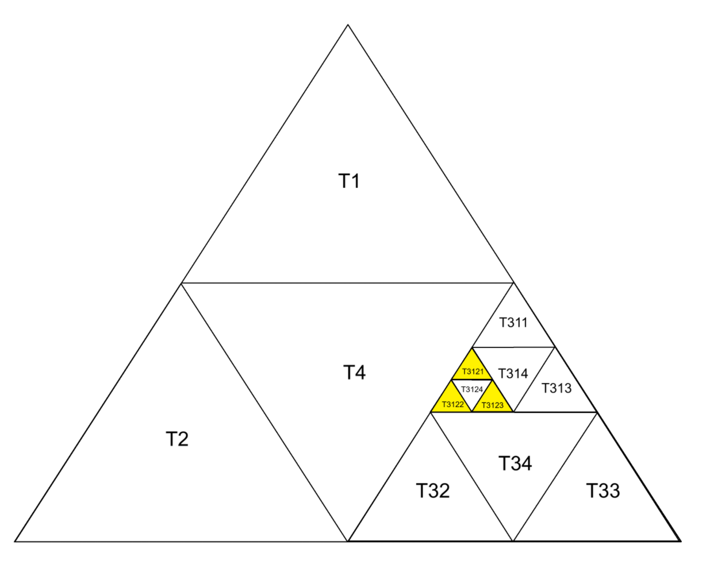

>不要再复制粘贴了！复制粘贴是美国人研制的新型鸦片！美国人往你的手机里安装大炮，当你复制粘贴时大炮就会被引燃，真是细思极恐！美国研发的ai编码机器人会自动生成复制粘贴，不费任何人力就能让你的孩子上瘾。现在的孩子竟然复制粘贴可见美国人已经毒害了中国青少年的心灵，你的孩子已经失去了原创能力！复制粘贴多有暴力元素，引导人走向暴力，残害家人和朋友！让你的孩子有自残倾向！其实这些都是美国人的诡计！如果现在的青少年打的都是这种东西，以后我们的国家怎么会有栋梁之材？坚决抵制复制，坚决抵制粘贴！如果你认同我的看法，请转发出去，转告你的亲友，不要再复制粘贴了，抵制复制粘贴！！！！

# 每日两题
---


# 一、基础题
### 题目：[P1012 [NOIP 1998 提高组] 拼数](https://www.luogu.com.cn/problem/P1012)

### 思路：

将所有数字看作字符串，排序时自定义比较规则：若`a+b`字典序比`b+a`大，则`a`排在`b`前。这样拼接后的结果就是最大的数。

### 代码(c++)：
时间复杂度 **O(nlogn)**

```cpp
#include <iostream>
#include <vector>
#include <algorithm>
#include <string>

using namespace std;

bool cmp(const string& a, const string& b) {
    return a + b > b + a;
}

void go() {
    int n;
    cin >> n;
    vector<string> a(n);
    for (int i = 0; i < n; i++) {
        cin >> a[i];
    }
    sort(a.begin(), a.end(), cmp);
    for (const auto& x : a) {
        cout << x;
    }
    cout << endl;
}

int main() {
    ios::sync_with_stdio(false);
    cin.tie(nullptr);
    cout.tie(nullptr);
    int t = 1;
    // cin >> t;
    while (t--) {
        go();
    }
    return 0;
}
```

# 二、提高题
### 题目：[[CQOI2007]三角形TRI](https://ac.nowcoder.com/acm/problem/19907)

### 思路：

先上图(部分图像)：

通过观察上图，我们可以发现
- 若编号末位为 4，则其三个相邻三角形为同级的 T…1、T…2、T…3。
- 若编号末位不为 4，则其相邻的三个三角形都是不一定同级的编号末尾为4的倒三角形。比如 $T3122$ 相邻的三个三角形为 $T3124$、$T34$、$T4$，$T3123$ 相邻的三个三角形为 $T3124$、$T314$、$T34$。
- 并且，编号末尾为1的与下边同级的4相邻，编号末尾为2的与右边同级的4相邻，编号末尾为1的与左边同级的3相邻。

我们尝试从外往里进行分析($T \underbrace{3112234}_{外\rightarrow里}$)，发现比较繁琐。因此反过来，从里到外进行分析。
- 对与 $T3121$ ，其同级相邻的是 $T3124$ ,上一级相邻的是 $T314$，上两级无相邻，上三级相邻的是 $T4$；
- 对于 $T3122$ ，其同级相邻的是 $T3124$ ,上一级无相邻，上两级相邻的是 $T34$，上三级相邻的是 $T4$；
- 对于 $T3123$ ，其同级相邻的是 $T3124$ ,上一级相邻的是 $T314$，上两级相邻的是 $T34$，上三级无相邻。

我们发现一个规律：编号越长的末尾数字（即更低级的编号）更早与同级的图形相邻。例如，$T3121$ 这个编号，末尾为1的前缀 $T3121$ 可以与同级的图形相邻，而更短的前缀 $T31$ 则不行。同理，编号 $T3122$ 的前缀 $T3122$ 可以与同级图形相邻，而 $T312$ 则不行；$T3123$ 也是如此。

因此，可以归纳为一条统一规则：
- 若编号 s 的末位是 4，则它的三个相邻三角形就是把末位依次改成 1、2、3 得到的同级三角形。
- 若末位不是 4，则从里到外扫描 s，分别记录首次出现的 1、2、3 的位置；对每个被首次遇到的数字 k∈{1,2,3}，将该位改成 4（保留其左侧前缀，丢弃右侧后缀），即可得到一个相邻的倒三角形。若某个数字未被遇到，则对应方向不存在相邻三角形。

最终把收集到的相邻编号按字典序输出即可。

### 代码(c++)：
时间复杂度 **O(len(s))**，`s`为输入的字符串。

```cpp
#include <iostream>    // 输入输出
#include <vector>      // 动态数组
#include <algorithm>   // sort
#include <string>      // 字符串

using namespace std;

void go() {
    string s;                 // 三角形编号，如 "T" 省略后只保留数字部分
    cin >> s;                 // 读入编号

    // 若末位为 4，则同级三个相邻分别是把末位改为 1、2、3
    if (s.back() == '4') {    // 末位是倒三角
        s.back() = '1'; cout << s << '\n';  // 改成 1
        s.back() = '2'; cout << s << '\n';  // 改成 2
        s.back() = '3'; cout << s << '\n';  // 改成 3
        return;
    }

    string cs = s;            // 工作副本：逐步截断右端
    reverse(s.begin(), s.end());  // 反转后从“里到外”扫描
    vector<string> ans(4);    // ans[1..3] 记录三个方向的相邻编号，ans[0] 不用

    // 从里到外，第一次遇到 1/2/3 的位置各产生一个相邻倒三角
    for (size_t i = 0; i < s.length() - 1; i++) { // 跳过最外层（反转后最后一个）
        int idx = s[i] - '0'; // 本层末位数字（原串的某个后缀末位）
        cs.back() = '4';      // 把该层改成 4，得到与之相邻的倒三角

        if (idx >= 1 && idx <= 3 && ans[idx].empty()) {
            ans[idx] = cs;    // 只取第一次遇到的那一层
        }
        cs.pop_back();        // 丢弃这一层，继续向外一层
    }

    sort(ans.begin(), ans.end());  // 按字典序排序（空串会被排到前面）
    for (int i = 0; i < 4; i++) {
        if (!ans[i].empty()) {     // 仅输出存在的相邻三角形
            cout << ans[i] << '\n';
        }
    }
}

int main() {
    ios::sync_with_stdio(false); // 加速 IO
    cin.tie(nullptr);
    cout.tie(nullptr);
    int t = 1;                   // 组数（如需多组，放开下面读入）
    // cin >> t;
    while (t--) {
        go();                    // 处理一组
    }
    return 0;
}
```

